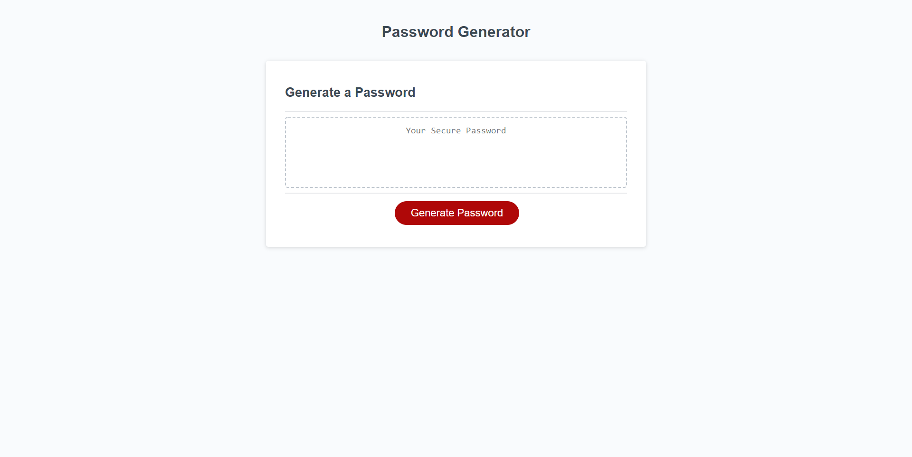
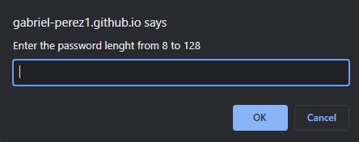
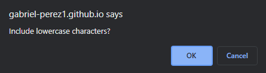

# Password Generator
The Password Generator web app generates a passwords based on the user selected criteria.

## Criteria
* Password character length from 8-128.

* Lowercase, uppercase, numeric and/or special characters.

## Technologies Used
The Password Generator was developed utilizing HTML, CSS and Javascript.

## Link
[Password Generator](https://gabriel-perez1.github.io/password-generator/)

## Challenge
Create an application that can generate a random password based on selected criteria.
